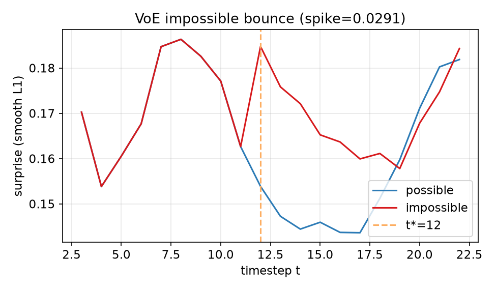
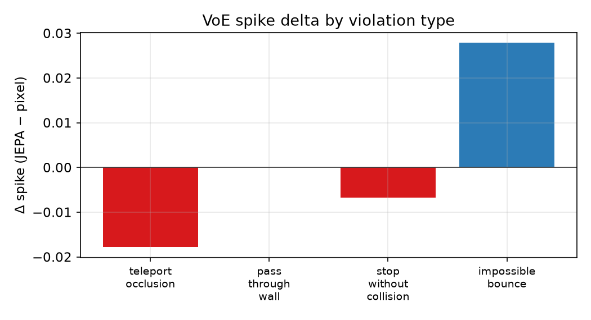

# PhysJEPA

[](https://physjepa.vercel.app)
[](https://www.python.org/downloads/)
[](https://pytorch.org/)
[](https://react.dev/)
[](LICENSE)
[](https://github.com/AvoCahDoe/PhysJEPA/releases)

**A controlled research project testing whether JEPA-style latent prediction encodes naive physics better than pixel reconstruction.**

Train two self-supervised world models on procedural 2D pymunk rollouts, then evaluate with **linear probes** and **violation-of-expectation (VoE)** surprise curves — methodology inspired by developmental psychology, implemented as a full ML pipeline with an interactive web demo.

**Live demo → [physjepa.vercel.app](https://physjepa.vercel.app)**

<p align="center">
  <a href="https://physjepa.vercel.app/try"></a>
  <a href="https://physjepa.vercel.app/results"></a>
</p>

---

## Highlights

| | JEPA | Pixel baseline |
|---|------|----------------|
| Position probe (xy val R²) | **0.421** | 0.415 |
| VoE Δ impossible bounce | **+0.028** | (baseline) |
| VoE Δ teleport | −0.018 | (baseline) |
| Visibility probe (val acc) | **0.944** | 0.940 |

**Finding:** JEPA shows a **selective** surprise spike on impossible bounce; teleport-under-occlusion stays weak — a nuanced partial result, not a clean universal win for either approach.

**Scale:** `paper_mid` run — 1,000 train episodes, 80 epochs, CUDA (RTX 4070 class).

---

## Interactive demo

| Route | Description |
|-------|-------------|
| [**/try**](https://physjepa.vercel.app/try) | All four violations — scroll through replays + live JEPA surprise |
| [**/play**](https://physjepa.vercel.app/play) | Same showcase; first scenario auto-plays |
| [**/results**](https://physjepa.vercel.app/results) | Metrics, VoE curves, probes, ablations, training — with interpretation |
| [**/docs**](https://physjepa.vercel.app/docs) | Concepts and math (JEPA loss, probes, VoE spike score) |

Deploy guide: [`docs/DEPLOY.md`](docs/DEPLOY.md)

---

## What I built

- **Custom 2D physics simulator** — pymunk sandbox with procedural scenes, occluders, and held-out VoE probe pairs
- **JEPA training stack** — CNN encoder, EMA target, MLP/GRU/Transformer predictors, smooth-L1 latent objective
- **Pixel baseline** — matched-capacity encoder–decoder for fair comparison
- **Evaluation suite** — frozen linear probes + VoE surprise curves + ablations (occlusion duration, predictor architecture)
- **Showcase web app** — Vite + React + Recharts multi-route demo on Vercel

---

## Tech stack

**ML:** Python · PyTorch · pymunk · NumPy · YAML configs  
**Eval:** Linear probes · VoE surprise · ablation sweeps  
**Frontend:** React · React Router · Recharts · KaTeX · Vite  
**Deploy:** Vercel (static SPA + committed JSON fixtures)

---

## Quick start

```bash
git clone https://github.com/AvoCahDoe/PhysJEPA.git
cd PhysJEPA

python -m venv .venv
source .venv/Scripts/activate   # Windows Git Bash
# source .venv/bin/activate     # Linux / macOS

pip install -e .
pip install torch torchvision --index-url https://download.pytorch.org/whl/cu128  # GPU
```

**Smoke test (minutes):**

```bash
python scripts/smoke_jepa.py
python scripts/smoke_pixel.py
```

**Full pipeline (`paper_mid`):**

```bash
python scripts/run_paper_mid.py --device cuda
```

**Local demo:**

```bash
python scripts/export_voe_demo_pairs.py
python scripts/sync_viz_fixtures.py --jepa-run paper_mid --pixel-run paper_mid
cd viz/dashboard && npm install && npm run dev
```

---

## Method (summary)

Procedural pymunk rollouts train a small **JEPA** (CNN encoder + EMA target + predictor) with smooth-L1 **latent** prediction only — no physics labels. A **pixel baseline** matches capacity but reconstructs frames. Held-out VoE pairs (possible vs impossible) test teleport, wall pass-through, stop-without-collision, and impossible bounce. **Linear probes** on frozen latents read out position, velocity, mass, and visibility.

Full write-up: [`docs/report.md`](docs/report.md)

---

## Repository layout

```
PhysJEPA/
├── src/physjepa/     # simulator, models, training, eval
├── scripts/          # CLI + run_paper_mid.py orchestrator
├── configs/          # YAML experiment configs
├── docs/             # report, figures, demo guide
├── viz/
│   ├── fixtures/     # committed demo JSON (paper_mid metrics)
│   └── dashboard/    # Vite + React showcase app
└── runs/             # gitignored — local training outputs
```

---

## Documentation

| Resource | Link |
|----------|------|
| Live demo | [physjepa.vercel.app](https://physjepa.vercel.app) |
| Technical report | [`docs/report.md`](docs/report.md) |
| Presentation guide | [`docs/DEMO.md`](docs/DEMO.md) |
| JSON schema (dashboard) | [`viz/SCHEMA.md`](viz/SCHEMA.md) |
| Static figures | [`docs/figures/`](docs/figures/) |

---

## Citation

```bibtex
@software{physjepa2026,
  author = {El Boubkraoui, Farid},
  title = {PhysJEPA: A Controlled JEPA Diagnostic for Naive Physics},
  year = {2026},
  url = {https://github.com/AvoCahDoe/PhysJEPA}
}
```

See also [`CITATION.cff`](CITATION.cff).

---

## Author

**Farid El Boubkraoui** — [farid.elboubkraoui@w-ays.de](mailto:farid.elboubkraoui@w-ays.de)

---

## License

MIT — see [`LICENSE`](LICENSE).
