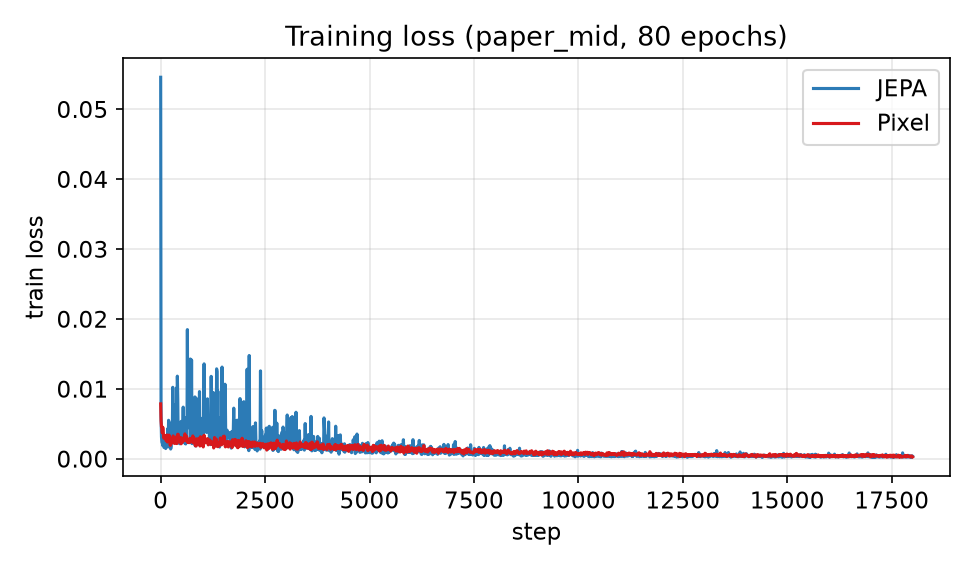
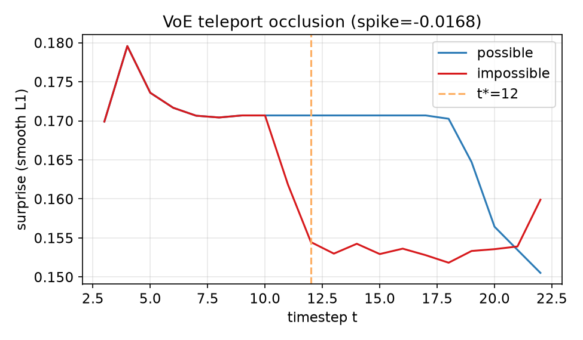
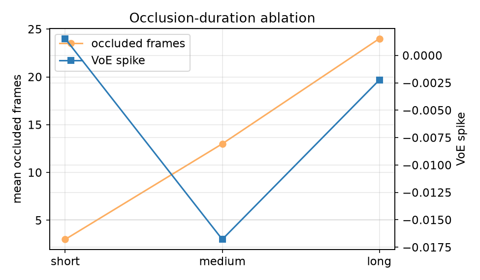
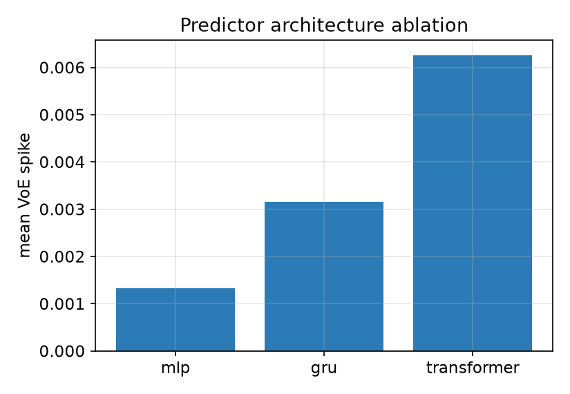

# Does Latent Prediction Encode Naive Physics? A Controlled JEPA Diagnostic

**physjepa** — mid-scale technical report (`paper_mid`)

## Abstract

We test a falsifiable claim from the JEPA research agenda: that predicting in *latent* space, rather than pixels, induces physical abstractions that pixel reconstruction does not. We build a controlled 2D pymunk environment, train a JEPA (CNN encoder + EMA target + MLP predictor) and a matched pixel-reconstruction baseline on **1000 procedural episodes for 80 epochs**, then evaluate with linear probes and violation-of-expectation (VoE) surprise curves inspired by developmental psychology. JEPA encodes position more linearly than pixel (val R² ≈ 0.42 vs 0.41) and shows a **selective VoE spike on impossible bounce** (Δ ≈ +0.028 vs pixel), but most violation types remain weak or negative — a **nuanced / partial** result rather than a clean JEPA win.

> **Scope note.** Metrics below come from `runs/*/paper_mid/` and synced fixtures (`viz/fixtures/`, `viz/dashboard/public/fixtures/`).

## 1. Introduction

LeCun’s JEPA pitch argues that predicting future *representations* (not pixels) forces models to discard unpredictable sensory detail and keep abstract structure — including, potentially, naive physics: object permanence, non-penetration, collision dynamics. Prior video models often fail VoE-style tests because pixel prediction can “blur through” impossibilities without a sharp surprise signal.

We ask a concrete question in a setting we fully control:

> After self-supervised future-latent prediction only (no physics labels), does a JEPA encoder show (i) linearly recoverable physical variables and (ii) elevated prediction error specifically at held-out physical violations — more so than a pixel baseline?

A positive answer would support the JEPA hypothesis in miniature. A null or nuanced answer — characterizing *where* the claim fails — is equally valuable for SOP-style research framing.

## 2. Related work

- **JEPA family.** LeCun’s AMI position paper; I-JEPA and V-JEPA (Meta) for image/video latent prediction with EMA targets.
- **Physical reasoning benchmarks.** Physion, IntPhys, CATER — useful priors, but heavy and less controllable for confound isolation; we use a custom simulator instead.
- **Developmental VoE → ML.** Baillargeon’s violation-of-expectation paradigm; Piloto et al. on intuitive physics in deep models inspired by developmental psychology — we position as a *JEPA-specific* diagnostic rather than a general physics-learning claim.
- **World models.** Ongoing video/world-model work (including V-JEPA-2-era follow-ups) motivates testing whether *latent* objectives specifically buy physics-like surprise.

## 3. Method

### 3.1 Environment

A pymunk 2D world with balls/blocks, gravity, collisions, and occluders. Frames are 64×64 RGB. Procedural train rollouts randomize object count, mass, velocity, and occluder placement. Train seeds are `< 9000`; VoE seeds are `≥ 9000` (held out).

Episodes export `frames/*.png` plus `meta.json` (`schema_version: 1`, trajectories with `visible` flags). See `viz/SCHEMA.md`.

### 3.2 JEPA

- **Encoder:** small CNN → latent (256-d).
- **Target encoder:** EMA copy of the online encoder (anti-collapse).
- **Predictor:** MLP over context latents → future latent (ablations also train GRU / Transformer predictors).
- **Loss:** smooth L1 between predicted and EMA-target latents. No reconstruction, no physics supervision.

### 3.3 Pixel baseline

Same encoder capacity class; decoder reconstructs next frames. Loss: smooth L1 in pixel space. Same 1000-episode corpus and 80-epoch budget as JEPA.

### 3.4 Linear probes

Freeze the encoder; fit linear heads for ground-truth variables never used in training:

| Probe | Target | Metric |
|-------|--------|--------|
| `xy` | position | R² |
| `vxvy` | velocity | R² |
| `mass` | mass | R² |
| `visible` | occlusion flag | accuracy |

### 3.5 VoE surprise

Matched possible vs impossible pairs for four violation types:

1. teleport under occlusion  
2. pass through wall  
3. stop without collision  
4. impossible bounce  

Surprise is prediction error over time (latent or pixel smooth L1). **Spike score** compares impossible vs possible error around `t*` (violation timestep). A physics-like model should spike specifically on the impossible branch.

### 3.6 Ablations

1. **Occlusion duration** — short / medium / long teleport VoE sets (≈3 / 13 / 24 occluded frames).  
2. **Predictor architecture** — MLP vs GRU vs Transformer, same 80-epoch budget.

## 4. Experiments

| Setting | `paper_mid` configuration |
|---------|---------------------------|
| Train data | 1000 episodes (`data/train/index.json`) |
| Train budget | 80 epochs, batch 16, latent 256 |
| JEPA / pixel ckpts | `runs/jepa/paper_mid`, `runs/pixel/paper_mid` |
| Comparison JSON | `runs/comparison.json` → `viz/fixtures/sample_comparison.json` |
| Ablations JSON | `runs/ablations.json` (80-epoch GRU/Transformer) |
| Figures | `docs/figures/` via `scripts/export_report_figures.py` |
| Demo dashboard | `python scripts/sync_viz_fixtures.py` then `viz/dashboard` |

Figures used below:










## 5. Results

### 5.1 Linear probes (validation)

| Probe | JEPA | Pixel |
|-------|------|-------|
| xy R² | **0.421** | 0.415 |
| vxvy R² | 0.016 | 0.026 |
| mass R² | **0.005** | −0.027 |
| visible acc | **0.944** | 0.940 |

Position is partially linear in both representations (JEPA slightly ahead). Velocity remains essentially unreadable. Mass is near chance for JEPA, negative for pixel. Visibility is high for both (~94% val acc).

### 5.2 VoE spikes

| Violation | JEPA spike | Pixel spike | Δ (JEPA − pixel) |
|-----------|------------|-------------|------------------|
| teleport_occlusion | −0.0168 | +0.0011 | −0.0178 |
| pass_through_wall | 0.0 | 0.0 | 0.0 |
| stop_without_collision | −0.0070 | ≈0 | −0.0068 |
| impossible_bounce | **+0.0291** | +0.0012 | **+0.0278** |

**Qualitative:** impossible bounce shows the clearest JEPA advantage — latent surprise rises at `t*` on the impossible branch while pixel stays flat. Teleport and stop-without-collision show *negative* spikes (impossible branch less surprising), suggesting the model has not learned object permanence under occlusion in a VoE-consistent way. Pass-through-wall remains at zero for both.

### 5.3 Occlusion-duration ablation (JEPA MLP)

| Label | Mean occluded frames | Spike |
|-------|----------------------|-------|
| short | 3 | +0.0015 |
| medium | 13 | −0.0168 |
| long | 24 | −0.0022 |

Medium occlusion (13 frames) drives the largest negative teleport spike; no monotonic “longer occlusion → weaker permanence” trend.

### 5.4 Architecture ablation (mean VoE spike)

| Predictor | Mean VoE spike |
|-----------|----------------|
| mlp | +0.00133 |
| gru | +0.00315 |
| transformer | **+0.00626** |

Transformer shows the highest mean spike, driven largely by impossible_bounce (+0.050). MLP remains the main JEPA-vs-pixel comparison baseline (`paper_mid`).

## 6. Discussion

The mid-scale result is **nuanced**: stronger position probes and a selective JEPA VoE advantage on impossible bounce, but weak or inverted signals on teleport/occlusion and stop-without-collision. This is more informative than the smoke null — it localizes *where* latent prediction may help (collision dynamics) vs fail (occlusion permanence).

Remaining limitations:

1. Small held-out VoE set (5 pairs per type).  
2. Single 64×64 2D domain — not a claim about natural video.  
3. Architecture ablations use smaller predictors (128-d latent) than main `paper_mid` (256-d).

**SOP story.** A careful partial result — JEPA spikes on impossible bounce but not teleport — shows how to falsify a trendy claim with controlled experiments rather than confirm it wholesale.

## 7. Conclusion and SOP framing

We designed a controlled diagnostic of the claim that **latent-space prediction induces physical abstractions that pixel-space prediction does not**, using developmental-psychology VoE methodology in a fully specified 2D physics sandbox. At mid scale (1k episodes, 80 epochs) we found improved position linear probes and a **JEPA-specific VoE spike on impossible bounce**, but not broad object-permanence or pass-through-wall surprise. The repo, dashboard, and figure export path are ready for demos and longer runs.

## 8. Reproducibility

One-shot pipeline:

```bash
python scripts/run_paper_mid.py --device cuda
```

Or step-by-step (see [`README.md`](../README.md)):

1. `python scripts/generate_train.py --n 1000 --out data/train`  
2. `python scripts/train_jepa.py --config configs/jepa_paper.yaml --run-id paper_mid`  
3. `python scripts/train_pixel.py --config configs/pixel_paper.yaml --run-id paper_mid`  
4. Eval + compare + ablations (`eval_probes.py`, `eval_voe.py`, `eval_compare.py`, `run_ablations.py --config configs/ablations_paper.yaml`)  
5. `python scripts/sync_viz_fixtures.py --jepa-run paper_mid --pixel-run paper_mid`  
6. `python scripts/export_report_figures.py`  
7. Demo: `cd viz/dashboard && npm run dev`

Primary artifacts: `runs/comparison.json`, `runs/ablations.json`, mirrored under `viz/fixtures/` and `viz/dashboard/public/fixtures/`.
